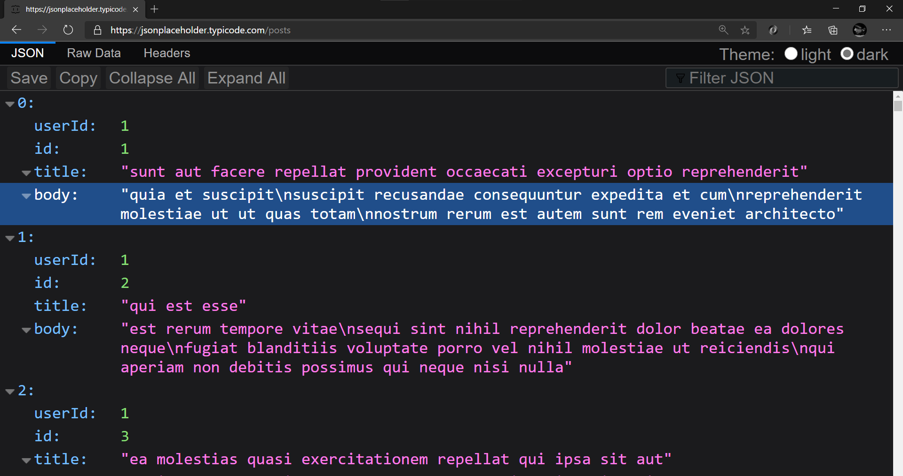

# extensions-4-every-developer

A list of extensions that every web developer must have

Please leave a star.

### Here is a list of extensions that every web developer should use

To contribute, follow the [contributing guidelines](https://github.com/KarenEfereyan/extensions-4-every-developer/blob/master/Contributing.md) and refer to the [snippet](https://github.com/KarenEfereyan/extensions-4-every-developer/blob/master/Snippet.md)

### 1. OctoTree:
This extension puts github on steriods. Gone are the days of ugly looking github repositories.

#### <em>Features</em>

- IDE-like code tree
- Customize how Github looks to you. Opt for the dark theme and customize the font of your text and much more...
- Folder and file search
- Support private repositories
- Repo/file/issue/pull request bookmarking
- High performance, working with repositories of any size
- Dark themes
- Multiple tabs
- File icon themes
- Code font settings
- Pull request code review
- Change sidebar docking position

#### <em>Availiabilty</em>

Octotree is available for download on [chrome](https://chrome.google.com/webstore/detail/octotree/bkhaagjahfmjljalopjnoealnfndnagc) and [mozilla](https://addons.mozilla.org/en-US/firefox/addon/octotree/)


### 2. Check My Links Extension:
This extension is a link checker that crawls through your webpage and looks for all things, links.
Broken links, valid links, redirecting links, we got you covered.

#### <em>Features</em>

- Tab showing number of links present on a webpage or website
- Queue with number of links left to account for as the crawler works
- Syntax highlighting for valid, redirect, warnings and invalid links

#### <em>Availability</em>

Check My Links is available for download on [chrome](https://chrome.google.com/webstore/detail/check-my-links/ojkcdipcgfaekbeaelaapakgnjflfglf?hl=en)


### 3. Windows Resizer:
This extension re-sizes the browser's window in order to emulate various resolutions.

#### <em>Features</em>

- Major device resolution on which to test your website
- Customizable list. Add/remove/reorder available resolution list
- Allow you set the window's width/height, window's position.
- Customizable global key shortcuts
- Export desired settings and import them into another computer

#### <em>Availability</em>

Windows resizer is available for download on [chrome](https://chrome.google.com/webstore/detail/window-resizer/kkelicaakdanhinjdeammmilcgefonfh?hl=en)


### 4. Color By Fardos:
This extension allows you pick colors from websites, save colors & gradients, get matching shades and tints and create beautiful gradients.

#### <em>Features</em>

- Color pick and save multiple colors from any site (using zoom technology) Cmd/Ctrl + Shift + e
- Save your favorite colors and gradients, click any color and it's HEX is saved to your clipboard
- Find shades, tints, complementary and other color combinations for any color
- Sync your colors between multiple Chrome Browsers
- Create linear or radial gradients with unlimited stops
- Browse hundreds of beautiful gradients, edit, save and copy it's CSS whenever you need it

#### <em>Availability</em>

Color By Fardos is available for download on [chrome](https://chrome.google.com/webstore/detail/color-by-fardos-color-pic/iibpgpkhpfggipbacjfeijkloidhmiei)


### 5. Css Viewer:
This extension is a simple Css property viewer. Hover over any element and get all the css properties attached to it

#### <em>Features</em>

- Hover over any html element and get all the css properties attached to it.

#### <em>Availability</em>

Css viewer is an available for download on [chrome](https://chrome.google.com/webstore/detail/cssviewer/ggfgijbpiheegefliciemofobhmofgce?hl=en)


### 6. Pesticide:
This extension outlines every element on a page thereby allowing the user see a better placement on the page.

#### <em>Features</em>

- Every element is outlined, like a box
- It is an absolute easy way to visualize box-sizing in CSS
- Hover over any box and immediately see the paddings, margins and border widths attached to that element via the box-sizing pane in the elements tab

#### <em>Availability</em>

Pesticide is available for download on [chrome](https://chrome.google.com/webstore/detail/pesticide-for-chrome-with/eipbgplchlidkojmppclhkechkhmlefi?hl=en) and [firefox](https://addons.mozilla.org/en-US/firefox/addon/pesticide-for-firefox/)


### 7. Wappalyzer:
This extension is a technology profiler that shows you what websites and web applications ae built with.

#### <em>Features</em>

- Allows you find what content management system a website uses
- Uncovers website tech nology into a range of categories like programming languages, analytics, marketing tools and many more...
- Tells the javascript frameworks, e-commerce platform that the given website or web application uses.

#### <em>Availability</em>

Wappalyzer is available for download on [chrome](https://chrome.google.com/webstore/detail/wappalyzer/gppongmhjkpfnbhagpmjfkannfbllamg?hl=en) and [firefox](https://addons.mozilla.org/en-US/firefox/addon/wappalyzer/)


### 8. Screencastify:
This extension helps to capture, edit and share videos in seconds.

#### <em>Features</em>

1. 🎥 Record

- Desktop, browser tab or webcam capture
- Narrate with your microphone’s audio
- Embed your webcam into the recording
- Full HD resolution

2. ✂️ Edit

- Trim the start and end of your videos
- Draw on your tab with the pen tool
- Merge, crop, and add text to videos (upgrade required)

3.  🚀 Share

- Videos autosave to Google Drive
- Copy shareable Drive link with one click
- Publish directly to your YouTube channel
- Share to Google Classroom
- Save and manage videos locally
- Export as MP4, animated GIF, or MP3

#### <em>Availability</em>

Screencastify is available for download on [chrome](https://chrome.google.com/webstore/detail/screencastify-screen-vide/mmeijimgabbpbgpdklnllpncmdofkcpn?hl=en)


### 9. Web Developer Checklist:
This extension helps developers by providing a yardstick to test if they have followed best practices

#### <em>Features</em>

- Analyses any web page for violations of best practices
- Easily discover problem areas in websites.
- Get grading on different areas where best practices should be observed like SEO, Mobile responsiveness, Usability, Accessibility
- Get the number of successful checks that passed the best practices test

#### <em>Availability</em>

Web Developer checklist is available for download on [chrome](https://chrome.google.com/webstore/detail/web-developer-checklist/iahamcpedabephpcgkeikbclmaljebjp?hl=en) and [firefox](https://addons.mozilla.org/en-US/firefox/addon/webdeveloperchecklist/)


### 10. What font:
This extension makes it ridiculously easy to identify fonts used in a website.

#### <em>Features</em>

- Hover over any text in a website and automatically get the fonts used
- Get access to the font family, font style, font-weight
- Get some more properties of the text like the size, line height, color along with a small square showing a preview of the color used for the text
- Allows you exit what font as the font checker keeps appearing as you move over the webpage

#### <em>Availability</em>

- What font is available for download on [chrome](https://chrome.google.com/webstore/detail/whatfont/jabopobgcpjmedljpbcaablpmlmfcogm?hl=en)and [mpzilla](https://addons.mozilla.org/en-US/firefox/addon/zjm-whatfont/)


### 11. Web Developer:
What a weird name for an extension. What it does is far from weird, though. This extension adds a toolbar button to the browser with various web developer tools.

#### <em>Features</em>

- Tons of web developer tools that can be toggled to add or remove from the current page
- When a given tool has been toggled on, an X icon is attached to the tool showing that it can be toggled off when clicked
- Web developer tools effectively categorized into forms, css, images, resizer and much more.

#### <em>Availability</em>

Web developer is available for download on [chrome](https://chrome.google.com/webstore/detail/web-developer/bfbameneiokkgbdmiekhjnmfkcnldhhm) and [firefox](https://addons.mozilla.org/en-US/firefox/addon/web-developer/)


### 12. Microsoft Teams Bot:
It's a bot which can attend your online classes/meetings on Microsoft Teams.

#### <em>Features</em>

- Attends your online classes/meetings
- User customisable timetable.
- User just needs to input the Team name, meeting start time and the duration of the meeting
- Joins the meeting provided that there is more than 1 attendee in the meeting
- Fully autonomous. Can add any number of meetings.
- Totally free to use
- 100% attendance for all your classes/meetings

<em>Advanced Features</em>

- If Deployed on an AWS/Azure Server, you don't need to switch on your desktop/laptop
- Zero MB of data consumption
- [Tutorial to deploy it on a server](https://youtu.be/93ik0MV-FAI)

#### <em>Availability</em>

Microsoft Teams Bot is available for download on [chrome](https://chrome.google.com/webstore/detail/n-bot-microsoft-teams-onl/onbankppjhoeccfkpnhogojjllbefglb)


### 13. Web Maker:
Blazing fast & offline playground for your web experiments.

#### <em>Features</em>

- Works offline
- User accounts
- Supports pre-processors: HTML (jade, markdown), CSS (SCSS, LESS, Atomic CSS, Stylus) & JavaScript (ES6, CoffeeScript, TypeScript)
- Inbuilt Console
- Save and load your creations with Auto-save
- Fork any creation
- Various templates for popular libraries - React, Vue and more
- Multi-monitor support with detached preview
- Import & Export all creations anytime, anywhere
- Multiple editor themes & other configurable settings
- Font options + use any system font
- Code auto completion
- Very easily accessible. Simply open a new tab in Chrome! (Configurable setting).
- Multiple layouts with saved collapsed states
- Save as HTML file
- Edit in CodePen
- Preview screenshot capture
- Open source on GitHub

### <em>Availability</em>
Web Maker is available for download on [chrome](https://chrome.google.com/webstore/detail/web-maker/lkfkkhfhhdkiemehlpkgjeojomhpccnh)

# 

### 14. uBlock Origin:
an efficient blocker. Easy on CPU and memory.

#### <em>Features</em>

- uBlock Origin filter lists
- EasyList (ads)
- EasyPrivacy (tracking)
- Peter Lowe’s Ad server list (ads and tracking)
- Online Malicious URL Blocklist

#### <em>Availability</em>
uBlock Origin is available for download on [chrome](https://chrome.google.com/webstore/detail/ublock-origin/cjpalhdlnbpafiamejdnhcphjbkeiagm?hl=en) and [mozilla](https://addons.mozilla.org/en-US/firefox/addon/ublock-origin/)


### 15. Lighthouse:
It is an open-source, automated tool for improving the quality of web pages. You can run it against any web page, public or requiring authentication. it runs a series of audits against the page, and then it generates a report on how well the page did.

#### <em>Features</em>

- It has audits for performance, accessibility, progressive web apps, SEO and more.

#### <em>Availability</em>

Choose the Lighthouse workflow that suits you best:

- In **[Chrome DevTools](https://developers.google.com/web/tools/lighthouse#devtools)** - Easily audit pages that require authentication, and read your reports in a user-friendly format.
- From the **[command line](https://developers.google.com/web/tools/lighthouse#cli)** - Automate your Lighthouse runs via shell scripts.
- As a **[Node module](https://developers.google.com/web/tools/lighthouse#programmatic)** - Integrate Lighthouse into your continuous integration systems.
- From a **[web UI](https://developers.google.com/web/tools/lighthouse#psi)** - Run Lighthouse and link to reports without installing a thing.


# 

### 16. Polypane:
A standalone browser with all the tools you need to build responsive, accessible and performant sites five times faster.

#### <em>Features</em>

- Multiple synced viewports for responsive testing.
- Detects CSS breakpoints and creates viewports from that.
- Device emulation for iPhone, Android etc.
- Media feature emulation: dark mode, reduced motion, print etc.
- Layout debugging (Every element is outlined, like a box) with overflow detection
- Devtools that edits all viewports at the same time.
- Copy all CSS for an element
- Pixel perfect social media previews for Twitter, Facebook, Slack, Google SERP, LinkedIn and Discord
- Built-in live reloading and auto reloading support
- Create full page screenshots
- Color blindness and other visual impairment simulators
- Devtools extension support
- Visual Design overlay diffing support

#### <em>Availability</em>

Polypane is available on Mac, Windows and Linux and is available here: [polypane.app](https://polypane.app)


### 17. Dark Theme For Chrome:
Dark Mode is an extension that helps you quickly turn the screen (browser) to dark at night time.

### <em>Features</em>

- The Toolbar button serves as an ON|OFF switch which enables you to easily and quickly turn the extension ON or OFF.

#### <em>Availability</em>

Dark Theme is available for downloads on [windows](https://chrome.google.com/webstore/detail/dark-mode/dmghijelimhndkbmpgbldicpogfkceaj?hl=en)


### 18. Prodeus :

This is a free extensions that keeps track of hours spent learning on Youtube and all other works done all along.

#### <em>Features</em>

- Keeps track of hours spent watching/learning on Youtube
- Add classes for different things you learn.
- Get a degree based on the amount of hours spent.
- Get resources(suggestions) from the library
- Connect the degree to your Linkedin profile

#### <em>Availiabilty</em>

Prodeus is available for download on [chrome](https://chrome.google.com/webstore/detail/prodeus/aglakbhkijgpmoploegcpnbnedgiampn)


### 19. Usersnap Extension:
This is a chrome extension that allows you capture your screen, collect user feedback, and track bugs reports on any website, prototype, or application.

#### <em>Features</em>
-  In-Browser Screenshots: you’ll get a screenshot of what your users experience. Quickly uncover browser-specific issues.

- No-Code Installation: with the browser extension, there’s no need to install any additional code on your site/app.

- Collaborate & Communicate: assign and track each item in Usersnap with your team. Add labels, attachments and comments to work better together.

- Console Log Errors: client-side javascript errors are captured with the screenshot. Minimize your time troubleshooting.

- Metadata Analyzed: Usersnap automatically includes the environment data to the tickets. URL, browser info, screen size, time, and location are some examples.

### <em>Availability</em>
Usersnapshot is available for download on [chrome](https://chrome.google.com/webstore/detail/usersnap-capture-visual-f/khehmhbaabkepkojebhcpjifcmojdmgd?hl=en)


### 20. Lorem Ipsum Generator Extension:
This extension provides an elegant and quick way to create default text or generate Lorem Ipsum. Optimized for quick usage, but it can customized.

#### <em>Features</em>
- Quickly delivers default text to complement your amazing design
- Easily customizable
- Each sentence is randomly generated to simulate real text.
#### <em>Availability</em>
Lorem ipsum generator is available for download on [chrome](https://chrome.google.com/webstore/detail/lorem-ipsum-generator-def/mcdcbjjoakogbcopinefncmkcamnfkdb/related?hl=en)


### 21. JSON Viewer:

The name explains the extension. It is automatically executed if a request to a URL returns JSON and presents it in a more readable, concise and accessible way. It is basically a port of Firefox's default JSON viewer.

#### <em>Features</em>
- Light and dark mode
- Filter the json object
- View response headers
- View the raw data returned
- Collapse/Expand all toggles
- Save the response as a JSON file

#### <em>Availability</em>

- Firefox has its own [JSON Viewer](https://developer.mozilla.org/en-US/docs/Tools/JSON_viewer)
- Chrome Web Store: [JSON Viewer](https://chrome.google.com/webstore/detail/json-viewer/efknglbfhoddmmfabeihlemgekhhnabb)
- Edge: Can install from the Chrome Web store



### 22. Session Buddy - Tab Management Extension
This is a chrome extension that allows developers to manage all open tabs in one place. It help users to easily restore open tabs whenever the chrome browser crashes.

#### <em>Features</em>
- Save open tabs as collections that can be easily restored later which helps to free up memory

- See and manage all open tabs in one place.

- Recover your open tabs after a crash.

- Search open tabs and collections to quickly find what you're looking for.

#### <em>Availability</em>
- Session Buddy is available for download on [chrome](https://chrome.google.com/webstore/detail/session-buddy/edacconmaakjimmfgnblocblbcdcpbko)


### 23. Pixel Perfect - Pixel Perfect Accuracy Extension
This is a chrome extension that helps develop accurate pixel perfect websites. It allows developers and designers to put a semi-transparent image over the top of the developed website as an overlay and make a pixel perfect comparison between them.

#### <em>Features</em>
- Multiple overlay support

- Separate overlays for each website

- Overlays are saved between browsing sessions

- Drag and drop file upload support

- Easy to use UI

- Paste from url and clipboard support

- Keyboard arrow keys and mousewheel support

#### Tips
- Double-click on header to expand/collapse main window

- Use Shift + arrow keys for 10px position change

#### <em>Availability</em>
- Pixel Perfect is available for download on [chrome](https://chrome.google.com/webstore/detail/perfectpixel-by-welldonec/dkaagdgjmgdmbnecmcefdhjekcoceebi)


### 24. ColorZilla Extension
-  With ColorZilla you can get a color reading from any point in your browser, quickly adjust this color and paste it into another program. And it can do so much more....

#### <em>Features</em>
- Eyedropper - get the color of any pixel on the page
- Advanced Color Picker (similar to Photoshop's)
- Ultimate CSS Gradient Generator
- Webpage Color Analyzer - get a color palette for any site
- Palette Viewer with 7 pre-installed palettes
- Color History of recently picked colors
- Displays element information like tag name, class, id, size etc

#### <em>Availability</em>
- Colorzilla is available for download on [chrome](https://chrome.google.com/webstore/detail/colorzilla/bhlhnicpbhignbdhedgjhgdocnmhomnp)


### 25. Clear Cache
-  This is a chrome extension that allows developers clear your cache and browsing data with a single click of a button.

#### <em>Features</em>
- You can customize what and how much of your data you want to clear on the options page, including: App Cache, Cache, Cookies, Downloads, File Systems, Form Data, History, Indexed DB, Local Storage, Plugin Data, Passwords and WebSQL.
- Cookies can either be removed globally, only for certain domains or for everything except for certain domains.

#### <em>Availability</em>
- Clear Cache is available for download on [chrome](https://chrome.google.com/webstore/detail/clear-cache/cppjkneekbjaeellbfkmgnhonkkjfpdn)


### 26. Grammarly
Grammarly helps you eliminate writing errors and find the perfect words to express yourself. You’ll get suggestions from Grammarly as you write on the web.

#### <em>Features</em>
- Contextual spelling checker.
- Grammar checker and suggestions.
- corrects critical spelling and grammar errors.
- Checks and eliminates plagiarism.

#### Tips
  If you own a blog or write about your dev projects/tutorials, grammarly helps out with grammar errors you may have missed including tips to improve phrases and sentences.

#### <em>Availiabilty</em>

Grammarly is available for download on [chrome](https://chrome.google.com/webstore/detail/grammarly-for-chrome/kbfnbcaeplbcioakkpcpgfkobkghlhen) and [mozilla](https://addons.mozilla.org/en-US/firefox/addon/grammarly-1/)


### 27. OneTab
OneTab Saves All Your Tabs Into a Shareable List.

#### <em>Features</em>
- Convert all of your tabs into a list.
- Save up to 95% of memory because you will have reduced the number of tabs open.
- "Share as a web page" to upload your list of tabs into a web page in order to share them with others.
- Moving tabs into OneTab can speed up your computer by reducing the CPU load.

#### <em>Availiabilty</em>
OneTab is available for download on [chrome](https://chrome.google.com/webstore/detail/onetab/chphlpgkkbolifaimnlloiipkdnihall) and [mozilla](https://addons.mozilla.org/en-US/firefox/addon/onetab/)


### FireShot
Capture pages fully and entirely. Create PDF files from web pages. Instant screenshots are stored locally, and produce no traffic. FireShot can work offline. You can either take full snapshots or select what part of the screen you want to snap.

#### <em>Features</em>
- Save screenshot to disk as PDF (with links), PNG, and JPEG.
- Capture only visible part of the web page or just a selection.
- Send to Gmail.
- Copy to clipboard.

#### <em>Availiabilty</em>
Fireshot is available for download on [chrome](https://chrome.google.com/webstore/detail/take-webpage-screenshots/mcbpblocgmgfnpjjppndjkmgjaogfceg) and [mozilla](https://addons.mozilla.org/en-US/firefox/addon/fireshot/)


### Ghostery:

Ghostery is a great Chrome extension which detects trackers, pixels, and any other embedded snippet on a website.

#### <em>Features</em>
- You can immediately see which plugins and trackers are installed on the web page you've visited.
- Lets you protect your privacy.
- There's no registration or sign-up required to use this chrome extension.

#### <em>Availability</em>
- Chrome Web Store: [Ghostery](https://chrome.google.com/webstore/detail/ghostery-%E2%80%93-privacy-ad-blo/mlomiejdfkolichcflejclcbmpeaniij?hl=en)


### 28. Prettier - VScode Extension
Prettier  formats all your code in a standard way. 

#### <em>Features</em>
- Spacing
- Line wrappings
- Consistent quotes

#### <em>Availiabilty</em>

Prettier is available for download on [chrome](https://marketplace.visualstudio.com/items?itemName=esbenp.prettier-vscode) and [mozilla](https://marketplace.visualstudio.com/items?itemName=esbenp.prettier-vscode)


### 29. Visual Inspector - Chrome Extension
Prettier  formats all your code in a standard way. 

#### <em>Features</em>
- Inspect and Change all design properties in web page like position, opacity, colors, gradient, typography etc.
- Edit website text inline without coding.
- Download changes as CSS / PNG and share it with other stakeholders.
- Get fonts, colors and assets from website in one click.

#### <em>Availiabilty</em>

Visual Inspector is available for download on [chrome](https://chrome.google.com/webstore/detail/visual-inspector/efaejpgmekdkcngpbghnpcmbpbngoclc)


### 30. Grid Ruler - Chrome Extension
Create grids and measure their distance easily.

#### <em>Features</em>
- It allow you to creates vertical and horizontal grids, Photoshop style.
- It has a ruler to measure distance between your grids too.

#### <em>How to use</em>
- drag from main vertical/horizontal ruler to create grids.
- click on intersection of vertical ruler and horizontal ruler to go into ruler mode.
- while in ruler mode, hold "Shift" key to get a straight line.

#### <em>Availiabilty</em>

Grid Ruler is available for download on [chrome](https://chrome.google.com/webstore/detail/grid-ruler/joadogiaiabhmggdifljlpkclnpfncmj)


### 31. Snipping Tool - Windows Extension
Snipping Tool is a Microsoft Windows screenshot utility included in Windows Vista and later. It can take still screenshots of an open window, rectangular areas, a free-form area, or the entire screen. Snips can then be annotated using a mouse or a tablet, stored as an image file or an MHTML file, or e-mailed.

#### <em>Features</em>

-  Windows screenshot
-  Capture Video


#### <em>Availiabilty</em>


Snipping Tool is available on Microsoft Windows [Windows](https://support.microsoft.com/en-us/windows/open-snipping-tool-and-take-a-screenshot-a35ac9ff-4a58-24c9-3253-f12bac9f9d44#:~:text=To%20open%20the%20Snipping%20Tool,Snip%2C%20and%20then%20press%20Enter.)


### 32. Jitsi Meeting - Web Extension
A simple extension that allows you to schedule online video meetings.

#### <em>Features</em>

-  It use by developer for collaboration.
-  Record meeting by any member.
-  Conference video call.
-  It is use for both audio and video call


#### <em>Availiabilty</em>

Jitsi is available on web and mobile application. it can be download [chrome](https://chrome.google.com/webstore/detail/jitsi-meetings/kglhbbefdnlheedjiejgomgmfplipfeb)


### 33. React Developer Tools - Browser Extension
React Developer Tools is a browser extension for the open-source React JavaScript library. It allows you to inspect the React component hierarchies in the Chrome Developer Tools.

#### <em>Features</em>
- It allows you tell if a web app was build with React
- It allows you check if it's a development build or production build
- Allows you check components and props used.

#### <em>How to use</em>
- You will get two new tabs in your Chrome DevTools: "⚛️ Components" and "⚛️ Profiler".
- The Components tab shows you the root React components that were rendered on the page, as well as the subcomponents that they ended up rendering.
- The Profiler tab allows you to record performance information.

#### <em>Availiabilty</em>

React devtools is available for download on [chrome](https://chrome.google.com/webstore/detail/react-developer-tools/fmkadmapgofadopljbjfkapdkoienihi), and on [firefox](https://addons.mozilla.org/en-US/firefox/addon/react-devtools)


### 34. Redux Developer Tools - Browser Extension
The extension provides power-ups for your Redux development workflow. Apart from Redux, it can be used with any other architectures which handle the state.

#### <em>Features</em>
- It allows you monitor actions and states of your application.
- It has the feature of playing and pausing to see how actions are triggered and how the states changes
- It's an opensource project. See the [official repository](https://github.com/zalmoxisus/redux-devtools-extension) for more details.

#### <em>How to use</em>
- You will get a new tab in your Chrome DevTools: "redux".
- It will show the action triggered and tabs to observe actions, states and differences

#### <em>Availiabilty</em>

Redux devtools is available for download on [chrome](https://chrome.google.com/webstore/detail/redux-devtools/lmhkpmbekcpmknklioeibfkpmmfibljd), and on [firefox](https://addons.mozilla.org/en-US/firefox/addon/reduxdevtools)


### 35. Camel Case Navigation - Visual Studio Code Extension
Camel Case Navigation extension provides Camel Case cursor navigation for the Visual Studio Code editor. It makes navigating between Camel-Cased words easy. Ever wrote a variable like `getStudentName` and you wanted to navigate in between `get`, `Student`, and `Name` ? This extension is for you!
.

#### <em>Features</em>
- It allows you switch between camel cased function names and variables.
- It's an opensource project. See the [official repository](https://github.com/maptz/Maptz.VSCode.Extensions.CamelCaseNavigation) for more details.

#### <em>How to use</em>
- MoveCamelLeftCommand (Ctrl+Left)
- MoveCamelRightCommand (Ctrl+Right)
- ExtendCamelLeftCommand (Ctrl+Shift+Left)
- ExtendCamelRightCommand (Ctrl+Shift+Right)

#### <em>Availiabilty</em>
You can install the latest version of the extension is available on the Visual Studio Marketplace [here](https://marketplace.visualstudio.com/items?itemName=maptz.camelcasenavigation).

Alternatively, open Visual Studio code, press Ctrl+P and type:

```ext install camelcasenavigation```


### 36. Bracket Pair Colorizer - Visual Studio Code Extension
As clear by the name of extension, this allows you to match the brackets in your code having different color for each pair. This extensions support user define colors and characters matching. 

- By default ```(), {}, []``` are matched, user can also define custom brackets. 
- Colors list can be modified. 
.

#### <em>How to use</em>
- It will automatically detect the brackets in your code once installed and activated.

#### <em>Availiabilty</em>
You can install the latest version of the extension is available on the Visual Studio Marketplace [here](https://marketplace.visualstudio.com/items?itemName=CoenraadS.bracket-pair-colorizer).


### 37. Fake Filler - Browser Extension
Fake Filler is THE form filler to fill all input fields on a page with randomly generated fake data. This productivity boosting extension is a must for developers and testers who work with forms as it eliminates the need for manually entering values in fields.
 

- Fill all inputs with randomly generated names, emails, phone numbers, etc
- Sensible defaults to allow you to start using the extension without any configuration 
- Powerful customization using custom fields
- Ignores CAPTCHA, hidden, disabled and readonly fields.

[](http://www.youtube.com/watch?v=fSRJzrvB3gQ "Fake Filler Demo")

#### [Official Website](https://fakefiller.com/)

#### Supported Browsers (Version >= 60)
- [Google Chrome](https://chrome.google.com/webstore/detail/fake-filler/bnjjngeaknajbdcgpfkgnonkmififhfo)
- [Mozilla Firefox](https://addons.mozilla.org/en-US/firefox/addon/fake-filler/)
- [Edge](https://microsoftedge.microsoft.com/addons/detail/fake-filler/bdcjobafgkjgckiikonbfcdocnhnaaii)

#### <em>How to use</em>
- [Install](https://chrome.google.com/webstore/detail/fake-filler/bnjjngeaknajbdcgpfkgnonkmififhfo?hl=en)
- 